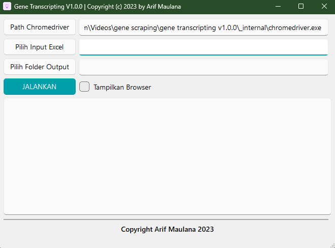

# Gene Transcription Application

This is a **Gene Transcription** application built using **Python** and **Selenium** to transcribe specific Gene IDs into Gene names. The application provides a user-friendly interface created with **PyQt5** and **QFluentWidget**. It allows users to input an Excel file containing Gene IDs, perform web scraping using Selenium, and export the transcribed results to a chosen output folder.

## Features

- **User-friendly GUI:** Built with PyQt5 and QFluentWidget.
- **Chromedriver Integration:** Users can input the path to the `chromedriver` required for Selenium-based scraping.
- **Excel Input:** Users can upload an Excel file containing the Gene IDs to be transcribed.
- **Browser Display Options:** Choose to run the transcription process in visible or headless mode.
- **Real-time Logs:** View detailed logs in a log window during the transcription process.
- **Output Selection:** Select the output folder where the transcribed results will be saved.

## Requirements

- **Operating System:** Windows 10 or Windows 11
- **Chromedriver:** Make sure to download the correct version of **Chromedriver** that matches your installed version of **Google Chrome**.

You can download `chromedriver` from [here](https://getwebdriver.com/).

## Installation

1. **Download the Application:**
   Download the pre-built application `gene transcripting.exe` from the provided link or source.

2. **Setup Chromedriver:**
   - Download the correct version of `chromedriver` based on your system's Google Chrome version.
   - Provide the full path to the `chromedriver` executable when prompted in the application.

3. **Input Excel Template:**
   Use the template provided (see `template.xlsx`) for your Gene IDs. The template should contain a column with Gene IDs that you wish to transcribe.

## Usage

1. **Launch the Application:**
   Double-click on the `gene transcripting.exe` to launch the application.

2. **Input Configuration:**
   - **Chromedriver Path:** Input the full path to the `chromedriver` executable.
   - **Input File (Excel):** Select the Excel file containing the Gene IDs. (Make sure to follow the format of the `template.xlsx`.)
   - **Output Folder:** Choose a folder where the transcribed Gene names will be saved.

3. **Browser Mode:**
   - Select **Show Browser** if you want to see the browser window while the scraping is in progress.
   - Select **Headless Mode** for a silent, background transcription without opening the browser.

4. **Start Transcription:**
   Click the **Start** button to begin the transcription process. Progress and logs will be displayed in the log window.

5. **View Results:**
   Once the process is complete, the transcribed Gene names will be saved in the selected output folder.

## Logging

All actions during the transcription process will be shown in the **Log Window** in real-time, providing information about each step and any issues encountered.

## Example Template

Use the provided `template.xlsx` file as a reference for the input Excel format. It should contain a column with Gene IDs like below:

|    ID    |
|----------|
|   ID_1   |
|   ID_2   |
|   ID_3   |

The output will map these IDs to their corresponding Gene names.

## Application Screenshot

## License

This project is licensed under the MIT License - see the [LICENSE](LICENSE) file for details.
